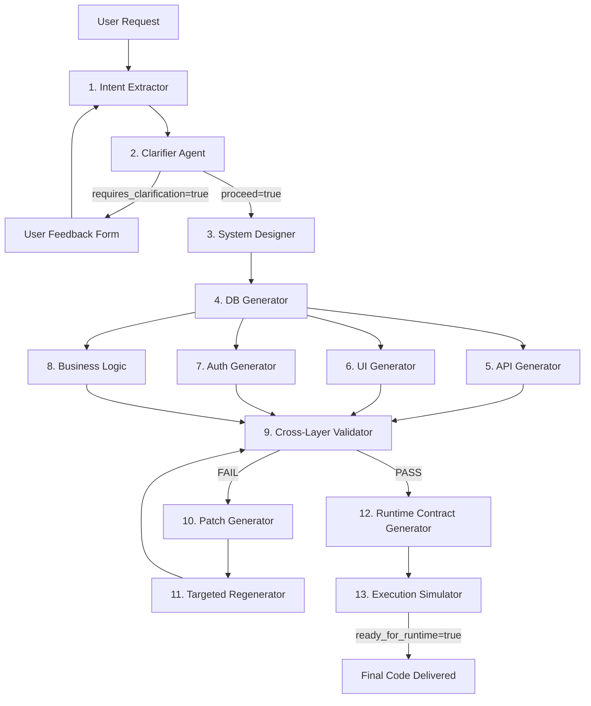

# esha.ai 🚀

> **Natural Language Software Compiler & Interactive Playground**

`esha.ai` is a state-of-the-art developer workspace and interactive compilation environment that compiles natural language software requests into fully formed, consistent, and executable runtime contracts (SQL schemas, TypeScript interfaces, Express API routes, Casbin RBAC policies, and React Router configurations) across a highly visual 15-stage pipeline.

---

## 🌟 Key Features

1. **Horizontal Timeline Process Map**: Track your compilation flow visually step-by-step through a sleek horizontal step indicator with animated status signals (Idle, Running, Success, Error, Repaired).
2. **Interactive Stage Workspace**: Explore the **Developer Prompt**, **Input Payload**, and **Output Payload** for each of the compiler's logical modules.
3. **Dual Engine Execution**:
   - **Interactive Simulation Mode**: Explores logical validation errors, targeted targeted repairs, and procedural contract creation.
   - **Claude API Mode (Live)**: Ingests your Anthropic API Key directly in the browser to stream real-time, stateless natural language compilation.
4. **Reactive Cascade Editing**: Modify the output of *any* stage and watch the reactive compiler automatically mark subsequent stages as dirty, prompting you to resume compilation with cascading logic.
5. **Consistency Validator Dashboard (Stage 9)**: Features a high-fidelity **Violations Log Table** displaying blinking severity badges, layer tags, clickable affected paths, and automatic targeted patching (Stages 10 & 11) for surgical self-healing!
6. **Clarification Loop (Stage 2)**: Halts compilation when vague or ambiguous prompts are inputted, presenting a beautiful clarification overlay to gather specifications and resume processing.
7. **SaaS Evaluation Benchmarks (Stage 14)**: Features pre-modeled templates for complex SaaS apps alongside edge-case adversarial prompts (vague, conflicting, incomplete).
8. **Tradeoff & Operating Metrics (Stage 15)**: Multi-dimensional metrics dashboard tracking success rates, latencies, parallelization maps, and bulk stress-testing simulators.

---

## 🛠 Tech Stack

- **Core**: Vanilla HTML5 & Modern ESM JavaScript.
- **Styling**: Premium Slate/Indigo Dark-Mode theme styled purely with Vanilla CSS (featuring glassmorphism, responsive Flexbox/Grid, and custom keyframe animations).
- **Runtimes Supported**: PostgreSQL, Node.js (TypeScript/Express), Casbin RBAC, React Router v6.

---

## 📋 15-Stage Compiler Pipeline



---

## 🚀 Getting Started (Run Locally)

Since `esha.ai` is engineered as a zero-dependency modern frontend application, it can be launched directly in any web browser without any local compilation or server installations.

1. Clone this repository:
   ```bash
   git clone https://github.com/Eshwar-143sai/esha.ai.git
   cd esha.ai
   ```
2. Open `index.html` directly in your browser:
   - On Windows: Double-click `index.html` or run `start index.html` in PowerShell.
   - On Mac: Run `open index.html` in Terminal.

---

## 📤 Publishing to GitHub

To link this prepared repository and push the code directly to your GitHub account:

1. Create a new public repository named **`esha.ai`** on your GitHub account (`Eshwar-143sai`).
2. Add the remote and push from your local terminal:
   ```bash
   # Add remote origin
   git remote add origin https://github.com/Eshwar-143sai/esha.ai.git
   
   # Push files
   git push -u origin main
   ```
